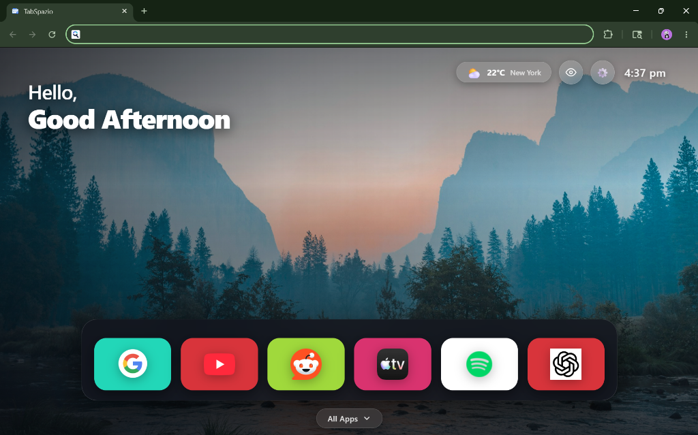
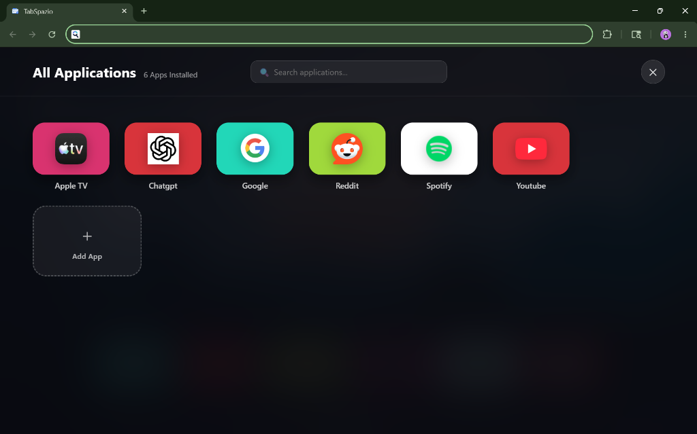

# 📺 TabSpazio

A highly customizable, cinematic **modern UI launcher extension** for your browser's New Tab page. Built with React 18, TypeScript, Vite, and CSS Modules.

---

## 📸 Screenshots

### 1. Homescreen Launcher & Weather Widget


### 2. All Applications Drawer & Search


---

## ✨ Features

- 🌟 **Modern Glassmorphic Interface**: Cinematic dark frosted glass tiles, dynamic accent glows, and fluid layout scaling.
- 🎨 **Clean Slate Setup**: Starts with zero hardcoded default apps. Add your own custom web apps or import from a JSON configuration file.
- 👁️ **Dock Visibility Toggle**: One-click quick toggle button right next to settings to easily show/hide the dock for an unobstructed scenic wallpaper view.
- 🏷️ **Floating Glass Tooltips**: Instant frosted glass name tooltips on mouse hover or remote/keyboard navigation.
- 💬 **Customizable Hero Greeting**: Personalize your greeting prefix (e.g., *Hello,*), dynamic title (e.g., *Good Evening*), or add your own custom subtitle message.
- 🌤️ **Live Open-Meteo Weather Integration**: Real-time temperature & condition widget next to the clock:
  - 📍 Built-in city geocoding location search
  - 🌡️ °C / °F unit toggle
  - ⏱️ Customizable background auto-refresh frequency (15m to 60m)
- 🎡 **Unlimited Horizontal Carousel Dock**: Add as many favorite apps as you want with smooth horizontal scrolling.
- 📱 **All Applications Full-Screen Drawer**: Centered A-Z grid drawer with instant search bar, app tile customization, duplication, and quick context menu.
- ⌨️ **2D Keyboard Navigation**: Fully navigable with arrow keys, Enter, and Escape — optimized for TV screens and media remotes.
- 💾 **Full Backup & Sync**: Complete JSON export & import for apps, appearance, greeting, clock, and weather configurations.
- 🔒 **100% Private & Local**: Zero tracking, zero ads, zero analytics. All data stays strictly local in your browser's extension storage (`chrome.storage.local`).

---

## 🛠️ Build & Installation for Development

### Prerequisites
- Node.js (v18 or higher)
- npm

### 1. Clone & Install Dependencies
```bash
git clone https://github.com/roshannzth/tabspazio.git
cd tabspazio
npm install
```

### 2. Run Local Development Server
```bash
npm run dev
```

---

## 📦 Building for Target Browsers

Build production extension bundles for your preferred target browser:

```bash
# Build for Google Chrome (Manifest V3)
npm run build:chrome

# Build for Mozilla Firefox
npm run build:firefox

# Build for Chromium / Edge / Opera / Brave
npm run build:chromium

# Build for all supported targets at once
npm run build:all
```

The output extension bundles will be generated in:
- `dist/chrome/`
- `dist/firefox/`
- `dist/chromium/`

---

## 🚀 Loading the Extension into Browsers

### 🌐 Google Chrome & Brave
1. Open `chrome://extensions`
2. Enable **Developer mode** (toggle switch in the top-right corner)
3. Click **Load unpacked**
4. Select the `dist/chrome/` folder

### 🦊 Mozilla Firefox
1. Open `about:debugging`
2. Click **This Firefox** on the left sidebar
3. Click **Load Temporary Add-on...**
4. Select `dist/firefox/manifest.json`

### 🌊 Microsoft Edge
1. Open `edge://extensions`
2. Enable **Developer mode** (toggle switch in bottom-left corner)
3. Click **Load unpacked**
4. Select the `dist/chromium/` folder

### 🔴 Opera
1. Open `opera://extensions`
2. Enable **Developer mode** (toggle switch in top-right corner)
3. Click **Load unpacked**
4. Select the `dist/chromium/` folder

---

## 📁 Project Architecture

```text
tabspazio/
├── manifests/              # Browser manifest manifests (Chrome, Firefox, Chromium)
├── scripts/                # Post-build packaging scripts
├── src/
│   ├── browser/            # Cross-browser extension API wrappers (storage, tabs, runtime)
│   ├── components/
│   │   ├── common/         # CustomSelect, Header, IconPicker, FallbackIcon
│   │   ├── dialogs/        # AddApp, EditApp, ConfirmDelete dialogs
│   │   ├── launcher/       # AppCard, AllAppsDrawer, WeatherWidget, HeroHeader, ContextMenu
│   │   └── settings/       # Appearance, Clock, Greeting, Weather, Backup & Sync, About
│   ├── context/            # AppContext state manager & storage persistence
│   ├── data/               # Default apps & schemas
│   ├── hooks/              # useWeather, useClock, useKeyboardNavigation, useSettings
│   ├── models/             # TypeScript interfaces (App, Settings)
│   ├── pages/              # HomePage, SettingsPage
│   └── services/           # storage, migration, favicon, importExport
└── vite.config.ts          # Vite extension configuration
```

---

## 🛡️ Privacy & Security

TabSpazio is committed to user privacy:
- No tracking or telemetry
- No external server dependencies (weather uses Open-Meteo's open public API)
- All configuration data is stored locally in `chrome.storage.local`

---

## 📜 License

This project is licensed under the **MIT License**.
